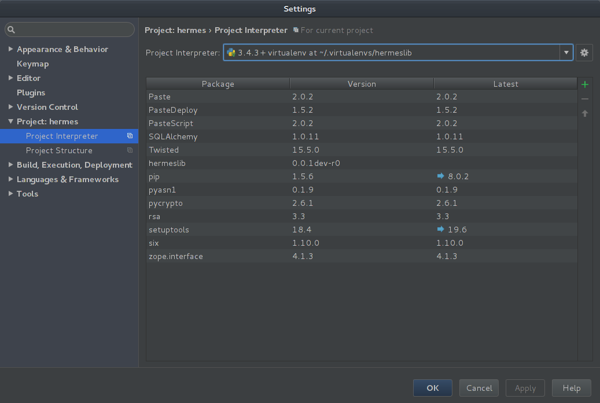
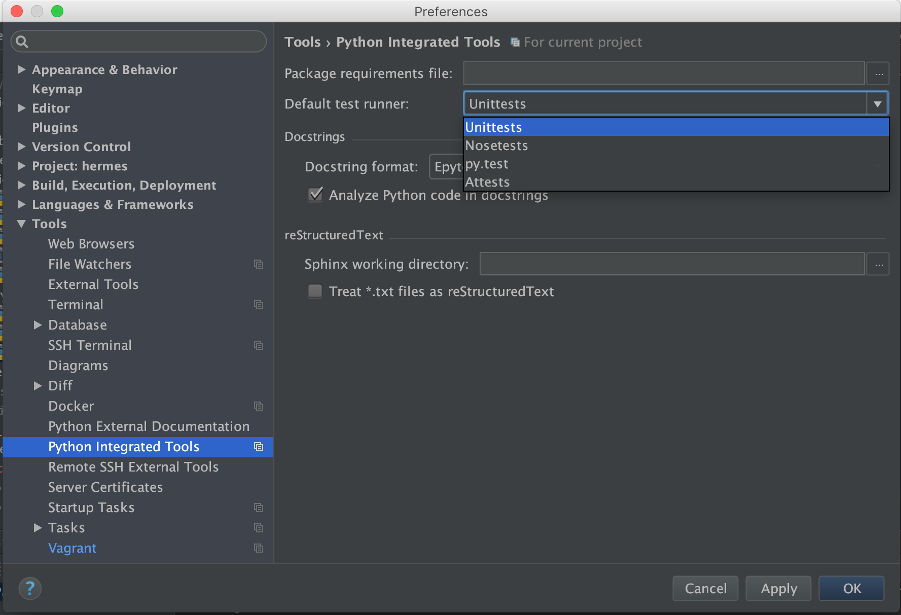
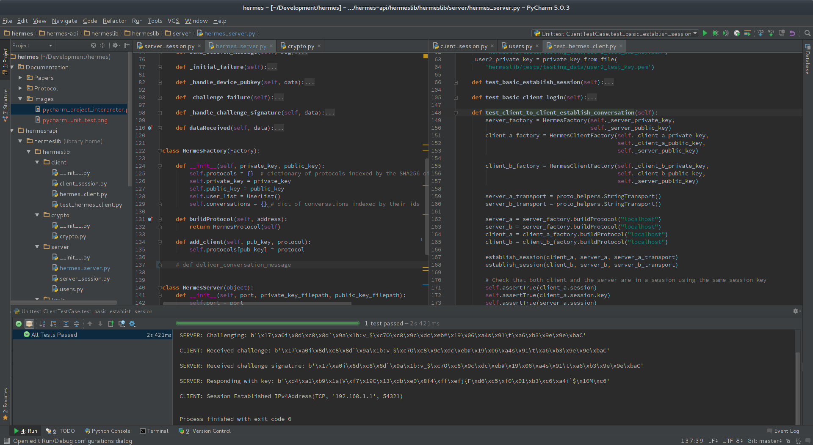
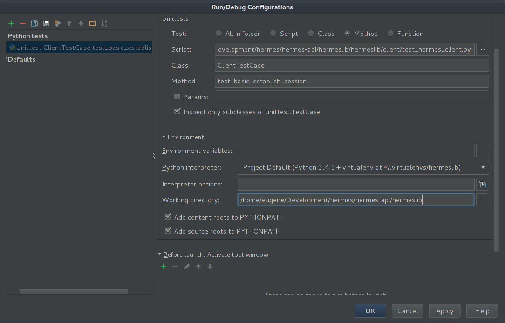

# Developer Instructions for Hermes-API

In order to get Hermes running in a way to develop parts of it, there are several things that need to be done. This document both tracks what was done to set up Hermes as a package and what needs to be done to get Hermes running well enough to run the unit tests.

## Getting to a Point Where One Can Run Unit Tests

Assuming you have cloned the hermes git repo. Run the following code starting from the hermes directory (i.e. the top-level directory in git).

### Step 1: Setup VirtualEnv using VirtualEnvWrapper (and a couple of compilation tools)

Install virtualenv and virtualenvwrapper like so:

```
# apt-get install python-virtualenv virtualenvwrapper
# apt-get install autoconf g++ python-dev python3-dev
```

Note that you may need to append the following to your `~/.bashrc` file before using virtualenvwrapper on Linux:

**~/.bashrc**
```
...

# VirtualEnvWrapper
. /etc/bash_completion.d/virtualenvwrapper
```

Create a new virtualenv in the `hermes/hermes-api/hermeslib/` directory

```
$ cd hermes/hermes-api/hermeslib
$ mkvirtualenv --python=/usr/bin/python3.4 hermeslib-dev
```

Now, whenever you want to work on hermeslib you can startup the environment by simply executing the command:

```
$ workon hermeslib-dev
```

### Step 2: Install dependencies

```
(hermeslib-dev)$ pip install twisted pycrypto sqlalchemy rsa pastescript
```

If you plan on running unit tests, you probably want to have code-coverage tools so make sure to install coverage as well in your development environment:

```
(hermeslib-dev)$ pip install coverage
```

### Step 3: Develop the Package

You can use the `setup.py` script to make sure that the package is ready to be programmed against. I believe you should execute this command every time you pull from hermes to make sure that everything is up-to-date in the package metadata.

```
(hermeslib-dev)$ python setup.py develop
```

#### Unit Testing

And now you should be ready to program HermesLib. To run the unit tests, simply execute the following command from the `hermes/hermes-api/hermeslib` directory:

```bash
(hermeslib-dev)$ python -m unittest discover -v
```

You can run a specific test case or a specific test from a test case like so (The example shows how to run the Crypto test cases, but you can do the same thing with server and client test cases):

```bash
(hermeslib-dev)$ python -m unittest -v hermeslib.crypto.test_crypto.CryptoTestCase # Run all tests in the test case
(hermeslib-dev)$ python -m unittest -v hermeslib.crypto.test_crypto.CryptoTestCase.test_symmetric_encryption_decryption # Run a single test
(hermeslib-dev)$
```

#### Code Coverage

If you are using coverage.py then you should be able to run unittests with coverage from the same directory as the unit tests and the same way that you would normally run unittests except with the `coverage run` command instead of `python`:

```bash
(hermeslib-dev)$ coverage run -m unittest discover
(hermeslib-dev)$ coverage run -m unittest -v hermeslib.crypto.test_crypto.CryptoTestCase # Run all tests in the test case
(hermeslib-dev)$ coverage run -m unittest -v hermeslib.crypto.test_crypto.CryptoTestCase.test_symmetric_encryption_decryption # Run a single test
```

Coverage stores the results of its tests in .coverage files throughout the development directory. I've added the .coverage files to the .gitignore file so that no one accidentally commits them.

You can view the commandline summary of the coverage results with the following command:

```bash
(hermeslib-dev)$ coverage report -m
```

And you can generate a much more detailed HTML version of the report with the following command, which will create htmlcov directories with html files inside your development directory that can be used to view the results in detail in your browser.

```bash
(hermeslib-dev)$ coverage html
```

#### Exiting

To exit from the virtualenv simply execute the command:

```
(hermeslib-dev)$ deactivate
```

---

### Setting Up With PyCharm IDE

In case you are using the PyCharm IDE with Hermes you can follow these steps to configure it to work conveniently. Assuming you have followed the instructions above and confirmed that you can run the unit tests:

1. Open the hermes directory in PyCharm

2. Go to File >> Settings >> Project: hermes >> Project Interpreter


3. In the list of interpreters you should find and select the virtualenv that you created vie the instructions above. Click "Apply" and "OK".

4. Also set default test runner in Tools >> Python Integrated Tools


5. Now you can right-click on any unit test function or class and select "Run 'Unittest ...'" from the context menu. It should fail the first time, but it will create an entry in the toolbar on the top right like so:


6. You can click "Edit Configurations" and configure the unit test you just created like so: (note the Working directory set to `.../hermes/hermes-api/hermeslib`)


7. Now you should be able to run that specific unit test via PyCharm's native interface without having to go to the terminal. It will also make PyCharm's syntax and import checking work correctly for the hermes environment. Two important things to note: First that you can play around with the unit test configuration settings and even expand them all the way to the class level (that inherits from TestCase), and second that I have not yet been able to find a configuration that correctly manages to execute all of the Hermes tests, so as of right now, these tests can only be executed on individual functions and classes. I will update this document once I have this figured out.

---

## How We Set Up Hermes

This section serves as a kind of environment setup log to track exactly what we did and how we did it as we developed Hermes. One should read this section, but it is not necessary to do anything here to get Hermes up and running. There is a lot in common between this section and the one above.

### Step 1: Installing VirtualEnv and VirtualEnvWrapper

Hermes uses python 3.4. As such, the first step was to make a python 3.4 virtualenv. For this I used the virtualenvwrapper script that is available [here](https://virtualenvwrapper.readthedocs.org/en/latest/install.html). VirtualEnvWrapper is a very nice tool for managing various virtual environments without polluting any of the actual development directories.

To install virtualenv and virtualenvwrapper on a Debian-based system, the following commands should be used.

```
# apt-get install virtualenv
# apt-get install virtualenvwrapper
# apt-get install autoconf g++ python-dev python3-dev
```

### Step 2: Setting Up a Virtual Environment

To setup the virtual environment, we simply need to execute the following commands:

```
$ mkvirtualenv --python=/usr/bin/python3.4 hermeslib
```

We can then enter the virtual environment by simply executing the command:

```
$ workon hermeslib
```

The cool part is that you can execute the `workon` command from any directory and get the hermeslib virtualenv.

### Step 3: Installing Required Python Packages

Hermes requires several python pacakges to function properly. The following should be installed inside the virtual env:

```
(hermeslib)$ pip install twisted
(hermeslib)$ pip install sqlalchemy
(hermeslib)$ pip install pycrypto
(hermeslib)$ pip install rsa
```

### Step 4: Setting Up the HermesLib Package

The next step is to make HermesLib into a package inside the virtual environment. For this, we are going to use a very nice tool called pastescript which generates all the metadata that we need to be included in the python package. So, assuming we executed step 2, we should now be in the hermeslib virtualenv and can execute the following:

```
(hermeslib)$ mkdir hermeslib
(hermeslib)$ pip install pastescript
```

Then we create the actual package which involves answering some questions for the script:

```
(hermeslib)$ paster create hermeslib
Selected and implied templates:
  PasteScript#basic_package  A basic setuptools-enabled package

Variables:
  egg:      hermeslib
  package:  hermeslib
  project:  hermeslib
Enter version (Version (like 0.1)) ['']: 0.0.1
Enter description (One-line description of the package) ['']: Library for servers and clients of the Hermes Secure Messaging Protocol
Enter long_description (Multi-line description (in reST)) ['']: Hermes is a protocol for secure chat messaging. This library defines the core of protocol as well as giving sample APIs that use it on both the server and the client sides.
Enter keywords (Space-separated keywords/tags) ['']: hermes cryptography chat messenger client server network twisted
Enter author (Author name) ['']: Eugene Kovalev
Enter author_email (Author email) ['']: euge.kovalev@gmail.com
Enter url (URL of homepage) ['']: eugene.kovalev.systems
Enter license_name (License name) ['']: GPLv3
Enter zip_safe (True/False: if the package can be distributed as a .zip file) [False]: False
Creating template basic_package
  Recursing into +package+
    Creating ./hermeslib/hermeslib/
    Copying __init__.py to ./hermeslib/hermeslib/__init__.py
    Recursing into __pycache__
      Creating ./hermeslib/hermeslib/__pycache__/
  Copying setup.cfg to ./hermeslib/setup.cfg
  Copying setup.py_tmpl to ./hermeslib/setup.py
Running /home/eugene/.virtualenvs/hermeslib/bin/python3.4 setup.py egg_info
```

### Step 5: Creating Package Components

By the time we did this step, we already had some of the source code (in fact this was meant to be a refactoring to get the imports to work properly). However, the general plan went something like this:

```
(hermeslib)$ cd hermeslib
(hermeslib)$ mkdir client
(hermeslib)$ touch client/__init__.py
(hermeslib)$ mkdir server
(hermeslib)$ touch server/__init__.py
(hermeslib)$ mkdir crypto
(hermeslib)$ touch crypto/__init__.py
(hermeslib)$ mkdir tests
(hermeslib)$ touch test/__init__.py
```

Then we can simply move/create the relevant files in their respective folders.

The final resulting `hermeslib` (corresponding to `./` in the example below) directory at the end of this process looked something like this (note that there is another `hermeslib` directory in there):
```
./
├── hermeslib
│   ├── client
│   │   ├── client_session.py
│   │   ├── hermes_client.py
│   │   └── __init__.py
│   ├── crypto
│   │   ├── crypto.py
│   │   ├── __init__.py
│   │   └── __pycache__
│   │       ├── crypto.cpython-34.pyc
│   │       └── __init__.cpython-34.pyc
│   ├── __init__.py
│   ├── __pycache__
│   ├── server
│   │   ├── hermes_server.py
│   │   ├── __init__.py
│   │   ├── __pycache__
│   │   │   ├── hermes_server.cpython-34.pyc
│   │   │   ├── __init__.cpython-34.pyc
│   │   │   └── server_session.cpython-34.pyc
│   │   └── server_session.py
│   ├── tests
│   │   ├── hermes_server_tests.py
│   │   ├── __init__.py
│   │   ├── __pycache__
│   │   │   └── test_crypto.cpython-34.pyc
│   │   ├── test_crypto.py
│   │   └── testing_data
│   │       ├── client_test_key.pem
│   │       ├── client_test_key_pub.pem
│   │       ├── server_test_key.pem
│   │       └── server_test_key_pub.pem
│   └── utils
│       ├── __init__.py
│       ├── logging.py
│       └── __pycache__
│           ├── __init__.cpython-34.pyc
│           └── logging.cpython-34.pyc
├── hermeslib.egg-info
│   ├── dependency_links.txt
│   ├── entry_points.txt
│   ├── PKG-INFO
│   ├── SOURCES.txt
│   ├── top_level.txt
│   └── zip-safe
├── setup.cfg
└── setup.py
```

### Step 6: Develop!

The final step is to simply execute the following command every time you want to work on hermeslib. Please note that this should be executed from top-level hermeslib directory. This will setup everything you need with the package paths to actually be able to run the code.

```
(hermeslib)$ python setup.py develop
```
---
# Installing the UI

This assumes you have installed virtualenv and virtualenvwrapper, and that you've named your virtual environment (not necessarily the directory!) `hermeslib-dev`

### Step 1: Install Qt5

http://www.qt.io/download-open-source/

Note the path to the Qt directory for step 3. Let's say it is called `Qt`

### Step 2: Download and install Sip

https://riverbankcomputing.com/software/sip/download

After unzipping:

```shell
$ cd sip-4.xx/
$ python3 configure.py -d $WORKON_HOME/hermeslib-dev/lib/python3.4/site-packages --arch x86_64
$ make
$ sudo make install
$ sudo make clean
```

### Step 3: Download and install PyQt5

https://riverbankcomputing.com/software/pyqt/download5

After unzipping:

```shell
$ cd PyQt-gpl-x.x.x/
$ python3 configure.py --destdir $WORKON_HOME/hermeslib-dev/lib/python3.4/site-packages --qmake Qt/5.5/clang_64/bin/qmake
$ make
$ sudo make install
$ sudo make clean
```


*There may be a chance that the 'make' step failed due to a missing C header. This is most likely the qgeolocation.h file. The solution from the below link seemed to work for me. Basically, just copy the header file from the link the user gives into PyQt-gpl-x.x.x/QtPositioning/, and run the 'make' step again.*

http://stackoverflow.com/questions/33446131/pyqt5-error-during-python3-configure-py-fatal-error-qgeolocation-h-file-no/33453675#33453675

### Step 4. Test to see that it has installed correctly.

```shell
$ workon hermeslib-dev
$ (hermeslib-dev) python -c "import PyQt5"
```

Nothing should happen. If you get an import exception, it hasn't been installed correctly.

## Installing a third-party Twisted reactor to work with Qt5

For now, until we have finalized how Twisted will integrate with Qt's event loop, we could use the reactor from this repo: https://github.com/sunu/qt5reactor.

Quoting from the repo's README on installing and using:

```shell
$ (hermeslib-dev) pip install qt5reactor
```

Before running / importing any other Twisted code, invoke:

```python
app = QApplication(sys.argv) # your code to init QtCore
from twisted.application import reactors
reactors.installReactor('qt5')
```
or
```python
app = QApplication(sys.argv) # your code to init QtCore
import qt5reactor
qt5reactor.install()
```
